# Lab8Web

## Membuat PHP dan Database MySQL

### Langkah-Langkah Praktikum
#### Persiapan

Untuk memulai membuat aplikasi CRUD sederhana, yang perlu disiapkan adalah
database server menggunakan MySQL. Pastikan MySQL Server sudah dapat dijalankan
melalui XAMPP.

#### Menjalankan MySQL Server
Untuk menjalankan MySQL Server dari menu XAMPP Contol.

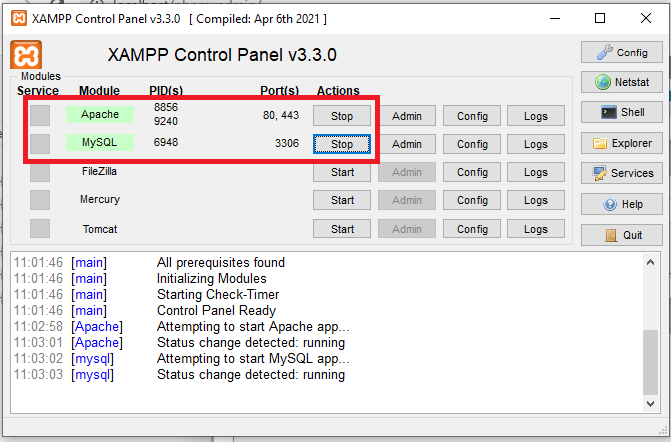

#### Mengakses MySQL Client menggunakan PHP MyAdmin
Pastikan webserver Apache dan MySQL server sudah dijalankan. Kemudian buka
melalui browser: `http://localhost/phpmyadmin/`

#### Membuat Database
Pada aplikasi `phpMyAdmin` klik ikon `Baru` yang ada di sebelah kiri tampilan.

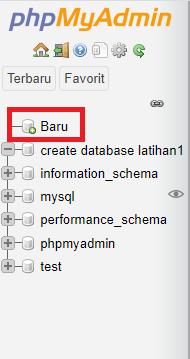

Kemudian masukan nama file dan klik ikon `Buat`.

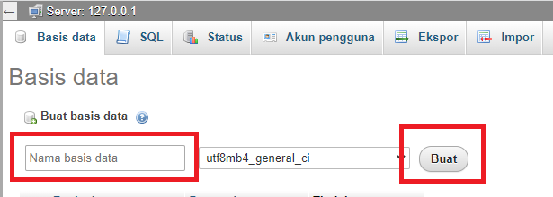

#### Membuat Table
Kemudian masukan nama table yang akan dibuat dan jumlah kolom yang diinginkan dan klik `Kirim`.

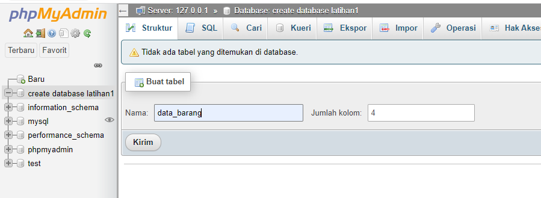

Akan muncul tampilan sebagai berikut.
masukan data yang diinginkan dan klik `Simpan`.

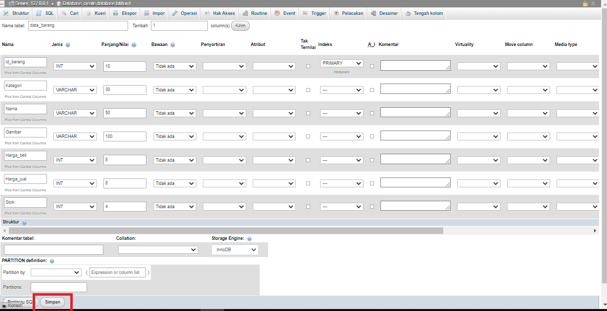

Tampilan table yang kita buat seperti berikut.

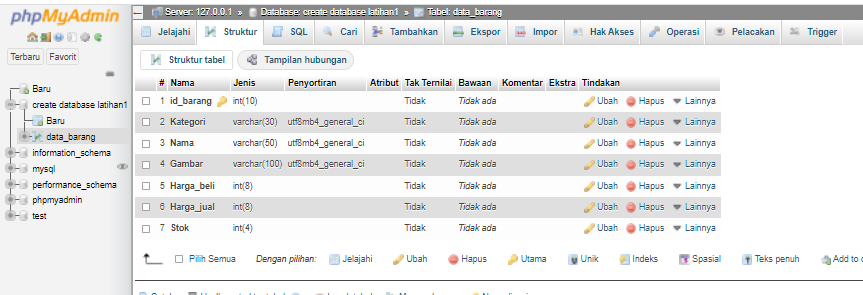

Langkah selanjutnya, klik pada pilihan menu `SQL` yang berada dideretan atas tampilan, dan masukan code seperti berikut.

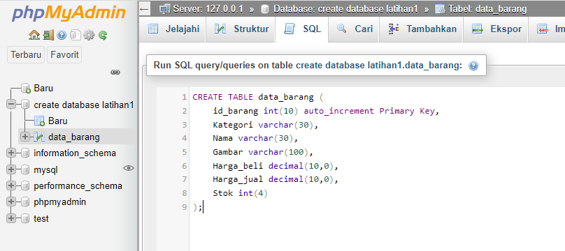

#### Menambahkan Data
Kemudian dilanjutkan untuk menambahkan data yaitu dengan klik pilihan menu `INSERT` yang ada dibagian bawah tampilan.

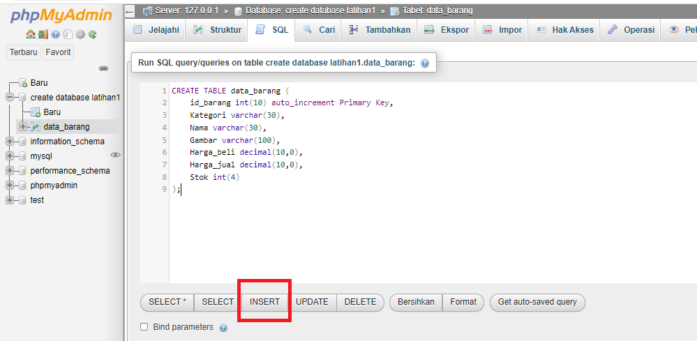

Tambahkan data seperti berikut ini.

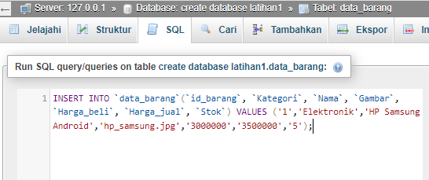

Tampilan hasil penambahan data seperti berikut ini.

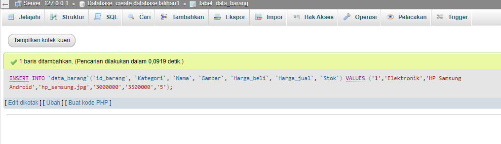

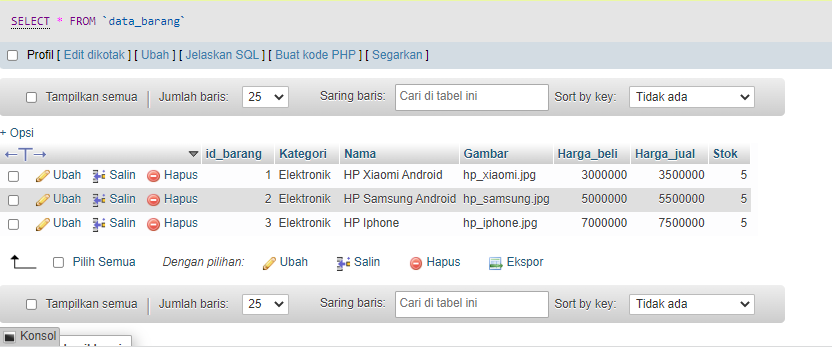

Kemudian untuk mengakses direktory tersebut pada web server dengan mengakses URL:
`http://localhost/lab8_php_database/`

Tampilan pada web server seperti berikut.

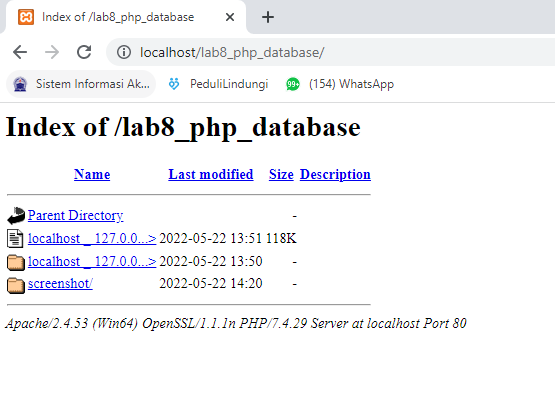

#### Membuat file koneksi database
Buat file baru dengan nama `koneksi.php`.
Masukan kode seperti berikut.

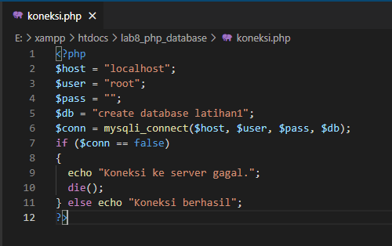

Buka melalui browser untuk menguji koneksi database (untuk menyampilkan pesan koneksi berhasil, uncomment pada perintah echo `“koneksi berhasil”`; 

Tampilan pada web server.

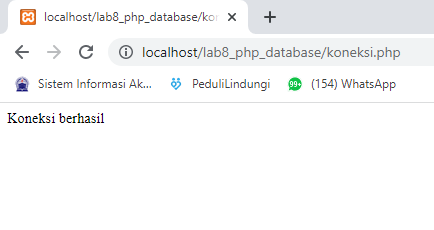

#### Membuat file index untuk menampilkan data (Read)
Buat file baru dengan nama `index.php`.
Masukan kode seperti berikut.

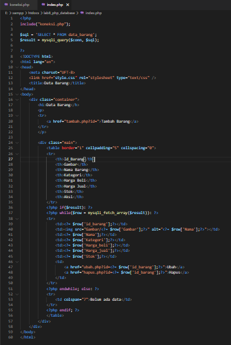

Tampilan pada web server akan seperti berikut.

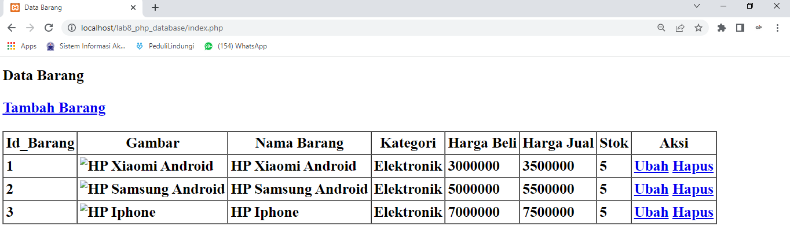

#### Menambah Data (Create)
Buat file baru dengan nama tambah.php
Masukan kode seperti berikut.

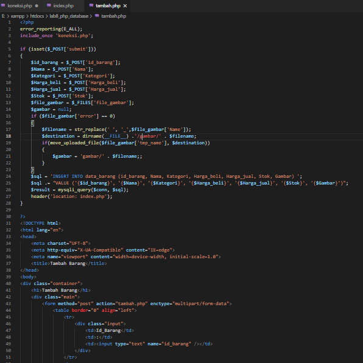

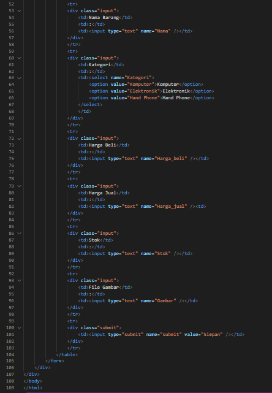

Maka, apabila kita klik pilihan `Tambah Barang`, akan muncul tampilan seperti berikut ini.

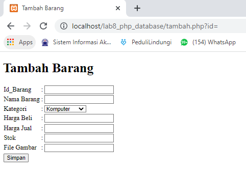

Masukan data yang ingin ditambahkan,contoh seperti berikut.

Tampilan pada web server akan berubah seperti berikut.

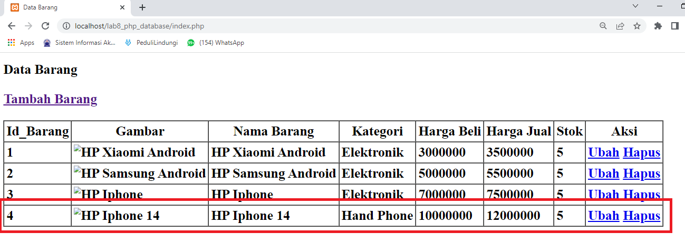

#### Mengubah Data (Update)
Buat file baru dengan nama `ubah.php`.
Masukan kode seperti berikut.

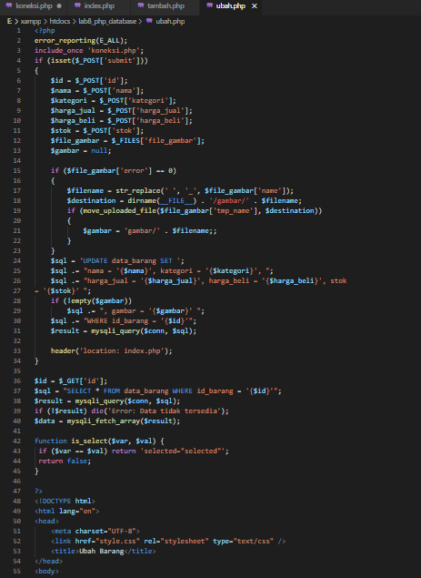

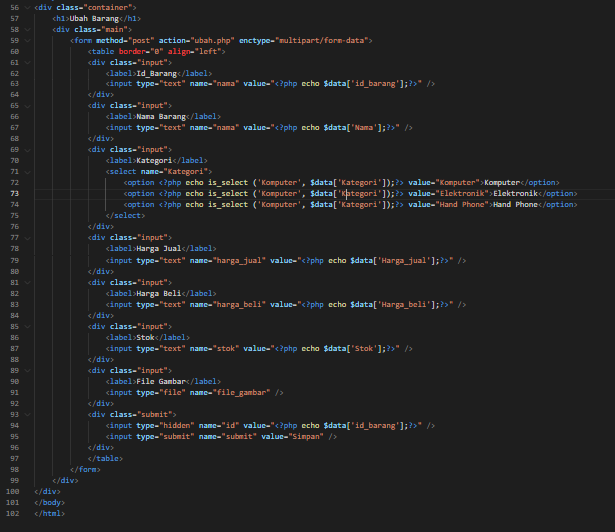

Maka apabila kita memilih pilihan ubah, tampilan akan seperti berikut. Saya mengambil contoh mengubah stok dari barang HP Iphone 14.

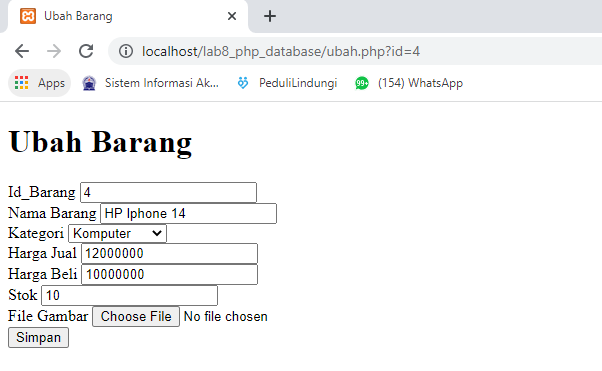

Setelah data diubah, klik `Simpan` untuk menyimpan.
Maka tampilan stok akan update sesuai perubahan, dan hasilnya seperti berikut.

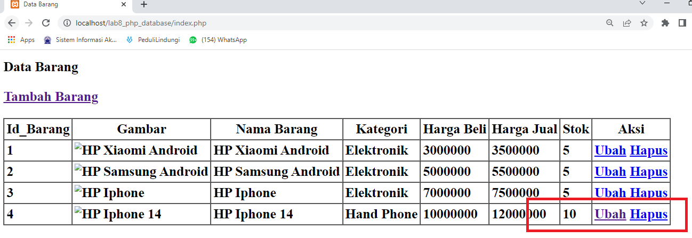

#### Menghapus Data (Delete)
Buat file baru dengan nama `hapus.php`.
Masukan kode seperti berikut.

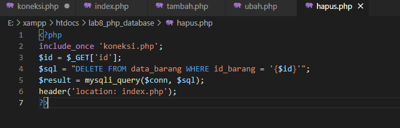

Kemudian pada tampilan web serve, apabila kita klik pilihan `Hapus`, maka data akan terhapus.
Sebagai contoh, disini saya menghapus data ke 3, yaitu HP Iphone.
Maka tampilan web server akan berubah, seperti berikut.

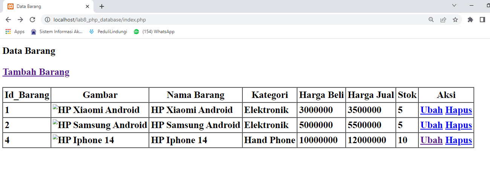

#### ~~ Demikian latihan praktikum mengenai PHP dan Database MySQL ~~
